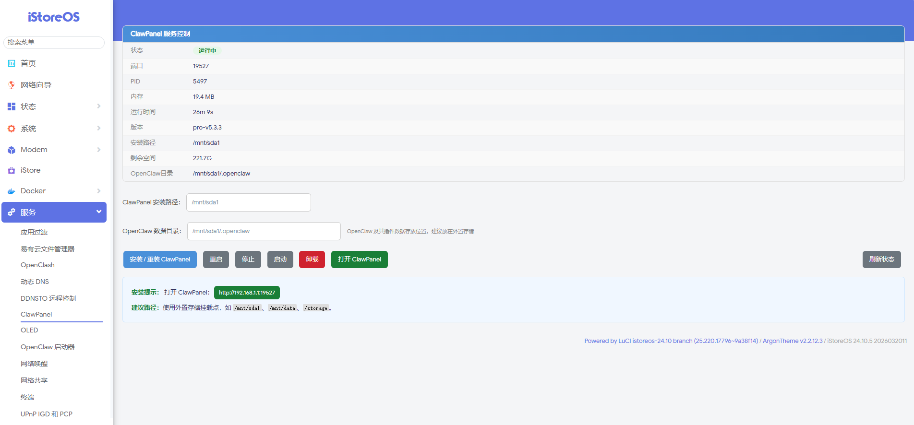
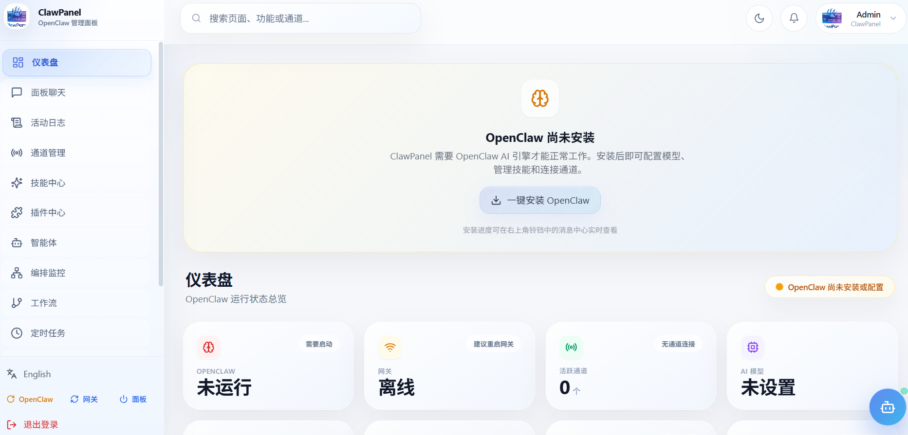

# luci-app-clawpanel

**OpenWrt / iStoreOS LuCI Plugin — ClawPanel Management Panel**

Install, start, stop, upgrade, and uninstall ClawPanel (OpenClaw AI assistant management panel) directly from the LuCI web interface on your OpenWrt / iStoreOS router.

---

## img




---

## Features

| Feature | Description |
|---|---|
| 📦 **One-click Install** | Auto-downloads latest ClawPanel Pro from GitHub |
| ▶️ **Service Control** | Start / Stop / Restart ClawPanel service |
| 🔄 **One-click Upgrade** | Detects latest version on GitHub and upgrades |
| 🗑️ **Clean Uninstall** | Removes binary, data, and UCI config |
| 📊 **Status Monitor** | Real-time PID, memory, uptime, disk space display |
| 🔒 **Auto-start** | Registers system service for boot persistence |

---

## Requirements

| Item | Requirement |
|---|---|
| RAM | ≥ 256 MB |
| Disk Space | ≥ 100 MB (**must be on external storage**) |
| CPU Architecture | aarch64 / x86_64 / armv7l |
| OS | OpenWrt, iStoreOS, LEDE and derivatives |

> ⚠️ **Must install to external storage** (e.g. `/mnt/sda1`, `/mnt/data`, `/storage`). Do **NOT** install to system partitions (`/`, `/overlay`, `/opt`), otherwise data will be lost after flashing.

---

## Before You Start

**1. Mount External Storage**

ClawPanel must run from external storage. If you don't have a mount point yet:

```
LuCI → System → Mount Points → Mount your USB drive
```

**2. Download the ipk**

Download the ipk for your router's architecture from GitHub Releases:

👉 https://github.com/a10463981/luci-app-clawpanel/releases/latest

Supported architectures:
- **aarch64** (ARM64) — most modern ARM routers
- **x86_64** (Intel/AMD) — x86_64 soft routers
- **armv7l** (ARM32) — older ARM routers

---

## Installation

### Method 1: OPKG Install (Recommended)

```bash
# 1. Upload the ipk to your router (via scp or USB drive)
scp luci-app-clawpanel_*.ipk root@192.168.1.1:/tmp/

# 2. SSH into router and install
opkg install /tmp/luci-app-clawpanel_*.ipk

# 3. Reload LuCI
/etc/init.d/luci reload
```

### Method 2: Git Clone (No Compilation Required)

If your router has git installed:

```bash
# SSH into your router and run:
cd /tmp
git clone https://github.com/a10463981/luci-app-clawpanel.git
cd luci-app-clawpanel
chmod +x root/usr/bin/clawpanel-env
cp -r root/* /
/etc/init.d/luci reload
```

### Method 3: Compile from Source (Developers)

Requires OpenWrt SDK:

```bash
# Clone into SDK package directory
git clone https://github.com/a10463981/luci-app-clawpanel.git \
  package/luci-app-clawpanel

# Build
cd $SDK_DIR
make package/luci-app-clawpanel/compile V=s
```

---

## Usage

**1. Open the Plugin Page**

Login to LuCI → top menu **Services** → **ClawPanel**

**2. First-time Install**

- Enter your external storage mount point in "ClawPanel 安装路径" (e.g. `/mnt/sda1`)
- Click **「安装 / 重装 ClawPanel」**
- Wait for download to complete (usually 1-5 minutes depending on network)
- Status should show "**运行中**" (Running) when done

**3. Access ClawPanel Dashboard**

Open your browser and visit:

```
http://192.168.1.1:19527
```

Default admin username: **`admin`**  
Default admin password: **`clawpanel`** (change this after first login)

**4.日常管理 (Daily Management)**

From the LuCI ClawPanel page you can:
- **重启** (Restart) — restart after config changes
- **停止** (Stop) — stop the service
- **启动** (Start) — start the service
- **卸载** (Uninstall) — completely remove ClawPanel and all data

---

## Data Directory Layout

| Directory | Contents |
|---|---|
| `{install_path}/clawpanel/` | ClawPanel binary and version file |
| `{install_path}/clawpanel/data/` | Runtime data (clawpanel.json config) |
| `{install_path}/.openclaw/` | OpenClaw engine config and plugin data |

> 💡 After reinstalling OpenWrt firmware, simply install this plugin again and point it to the same mount point — all programs and data will be preserved automatically.

---

## Project Structure

```
luci-app-clawpanel/
├── Makefile                         # OPKG package definition
├── VERSION                          # Plugin version
├── README.md                        # Chinese documentation
├── README_EN.md                     # English documentation
│
├── root/
│   ├── etc/
│   │   ├── config/clawpanel        # UCI config (enabled/port/install_path)
│   │   ├── init.d/clawpanel        # System service init script
│   │   └── uci-defaults/99-clawpanel  # First-install init
│   └── usr/bin/clawpanel-env       # Install/upgrade/uninstall shell script
│
└── luasrc/
    ├── controller/clawpanel.lua       # LuCI routes + 8 API endpoints
    ├── model/cbi/clawpanel/basic.lua  # CBI form entry
    └── view/clawpanel/             # HTML templates
        ├── main.htm                  # Status panel main page
        ├── basic.htm                 # CBI rendering template
        ├── status.htm                # Status fragment
        ├── basic_install.htm         # Install dialog
        └── basic_uninstall.htm       # Uninstall confirmation
```

---

## Architecture

```
┌────────────────────────────────────────────────────────┐
│                    OpenWrt Router                       │
│                                                        │
│   ┌──────────────┐      ┌─────────────────────────┐  │
│   │ LuCI Web UI  │ ←──→ │ luci-app-clawpanel    │  │
│   │  (Browser)   │ UCI  │  (Lua Controller)      │  │
│   └──────────────┘      └──────────┬──────────────┘  │
│                                    │                   │
│                      ┌─────────────▼──────────────┐   │
│                      │  clawpanel-env (Shell)   │   │
│                      │  · Downloads binary        │   │
│                      │  · Writes config          │   │
│                      │  · Starts service         │   │
│                      └─────────────┬──────────────┘   │
│                                    │                   │
│   ┌────────────────────────────────▼─────────────────┐│
│   │         ClawPanel  (:19527 + :19528)             ││
│   │  Go single binary, Web UI + REST API + React    ││
│   │  Data: /mnt/sda1/clawpanel/data                  ││
│   │  OpenClaw: /mnt/sda1/.openclaw                  ││
│   └──────────────────────────────────────────────────┘│
└────────────────────────────────────────────────────────┘
```

---

## Links

| Project | URL |
|---|---|
| **Plugin Releases** | https://github.com/a10463981/luci-app-clawpanel/releases |
| **ClawPanel Upstream** | https://github.com/zhaoxinyi02/ClawPanel |
| **OpenClaw Engine** | https://github.com/openclaw/openclaw |
| **Report Issues** | https://github.com/a10463981/luci-app-clawpanel/issues |

---

## License

### This Plugin
**CC BY-NC-SA 4.0**  
Copyright © 2025-2026 a10463981

- Attribution — copyright notice must be retained
- Non-Commercial — commercial use is prohibited
- Share-Alike — derivatives must use the same license

Full license: https://creativecommons.org/licenses/by-nc-sa/4.0/

### Upstream Projects

- **ClawPanel**: CC BY-NC-SA 4.0 — Copyright © zhaoxinyi02
- **OpenClaw**: Custom open source license — Copyright © OpenClaw Authors

---

## Disclaimer

This plugin is provided "as is" without any warranty. All risks arising from use of this plugin are borne by the user.

Using third-party clients to log into QQ/WeChat may violate Tencent's terms of service and may result in account bans. Use a test account for any such integration.
